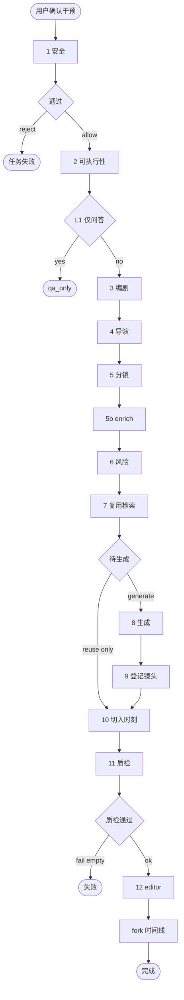

# Hermes 叙境 — AI 互动叙事视频平台产品文档

| 项目 | 说明 |
|------|------|
| 版本 | 0.1.0 |
| 最后更新 | 2026-05-05 |

---

## 1. 产品概述

### 1.1 什么是叙境（Hermes）？

**叙境** 是一套面向 **长视频 / 成片** 的 **AI 互动叙事放映与剧情干预** 系统。用户上传一条视频后，系统会自动完成以下工作：

```
┌───────────────────────────────────────────────────────────────────┐
│                                                                   │
│   用户上传视频 ──→ AI 分析镜头 ──→ 建立角色库 ──→ 生成时间线       │
│         ↓               ↓               ↓               ↓          │
│   观看放映厅 ←→ 追问剧情/提问 ← 发起叙事干预 ←─ 生成新镜头         │
│         ↓               ↓               ↓                          │
│   分支时间线 ←───── 任务流水线 ←───── 媒资库沉淀                   │
│                                                                   │
└───────────────────────────────────────────────────────────────────┘
```

### 1.2 核心价值

| 能力 | 说明 |
|------|------|
| **一致的世界观与角色** | 角色库、用户备注与镜头分析一并注入编剧/导演/分镜/生视频提示词，降低「跳戏」与脸崩。 |
| **可分支的放映体验** | 每次干预可 fork 新时间线；支持调整切入时刻、片段重排与删除生成段。 |
| **可运营的资产沉淀** | 原片镜头 + 干预生成镜头统一进入媒资库，支持缩略图、结构化字段与 ASR 回填。 |
| **可配置的模型栈** | 支持 `.env` 与（可选）SQLite `model_configs` 合并解析，多档 `fast` / `quality` 配置。 |

### 1.3 非目标（当前版本）

- 非面向短视频批量模板化生产的主站；侧重 **单成片深度互动**。
- 非实时多人协作编辑同一镜头时间线的 Google Docs 式产品（以单用户/演示为主）。
- 部分链路依赖外网 API；`mock` 模式用于开发与演示，不保证成片质量。

### 1.4 全项目主流程图（端到端）

```
┌────────────────────────────────────────────────────────────────────────┐
│                           叙境系统主流程                                │
├────────────────────────────────────────────────────────────────────────┤
│                                                                         │
│  ┌───────────┐    ┌───────────┐    ┌───────────┐    ┌───────────┐   │
│  │  阶段 A   │───▶│  阶段 B   │───▶│  阶段 C   │───▶│  阶段 D   │   │
│  │  成片入库  │    │ 时间线生成 │    │   放映厅   │    │ 干预流水线 │   │
│  └───────────┘    └───────────┘    └───────────┘    └───────────┘   │
│       │                │                │                │            │
│       ▼                ▼                ▼                ▼            │
│  · 上传成片        · 创建主线        · 选择时间线      · 安全审查      │
│  · FFmpeg切分      · 片段列表        · 视频播放        · 编剧导演      │
│  · VLM分析         · 生成剧情        · 问答对话        · 分镜生成      │
│  · 角色聚合        · StoryState      · 叙事干预        · 视频生成      │
│                                                                         │
│  ┌───────────┐    ┌───────────┐                                           │
│  │  阶段 E   │───▶│  阶段 F   │                                           │
│  │  资产沉淀  │    │  分支切换  │                                           │
│  └───────────┘    └───────────┘                                           │
│       │                │                                                  │
│       ▼                ▼                                                  │
│  · 任务日志        · 新 Timeline                                        │
│  · 媒资库         · 继续播放                                            │
│                                                                         │
└────────────────────────────────────────────────────────────────────────┘
```

**详细流程说明：**

| 阶段 | 模块 | 说明 |
|------|------|------|
| **A** | 成片入库 | 用户上传视频 → FFmpeg 转码 → 多粒度切片 → VLM 镜头分析 → 角色聚合 |
| **B** | 时间线生成 | 创建主线 Timeline → TimelineSegment → 生成 StoryState 剧情记忆 |
| **C** | 放映厅 | 选择时间线 → 视频播放 → 用户对话（问答/干预）|
| **D** | 干预流水线 | 安全审查 → 可执行性分级 → 编剧/导演/分镜 Agent → 风险评估 → 媒资复用 → 视频生成 → 质检 → Fork |
| **E** | 资产沉淀 | 任务日志 Jobs → 媒资库 → 模型配置 |
| **F** | 分支切换 | 切换到新 Timeline → 继续播放 |

---

## 2. 目标用户与典型场景

### 2.1 目标用户

- **IP 方 / 内容实验**：希望在正片外尝试「观众一句话改剧情」的体验样片。
- **互动影游 / 叙事产品**：需要可回放、可版本化的时间线与任务日志，便于联调剧情引擎。
- **内部工具链**：将已有成片导入，快速建立镜头级检索与角色库，供后续生成管线使用。

### 2.2 典型用户旅程

```
1. 上传成片 → 自动 ingest（时长、海报、切分粒度、镜头分析）
         ↓
2. 媒资库 → 汇总角色、富化身份与参照图、填写用户备注（关键设定与后续伏笔）
         ↓
3. 放映厅 → 选择时间线播放；侧边解说/问答；必要时发起干预
         ↓
4. 任务页 → 查看某次干预的流水线日志、分镜计划、复用与生成片段
         ↓
5. 设置 → 配置或查看各链路模型（只读展示来自 .env 的快照）
```

---

## 3. 界面概览与功能模块

本节界面以流程图描述结构；**真实 UI** 请以本地前端为准（开发环境通常为 `http://localhost:5173`，取决于 Vite 配置）。

### 3.1 主导航结构

**界面示意图（建议截图位置）：** 放映厅页面 → 页面顶部导航栏

```
┌────────────────────────────────────────────────────────────────────────┐
│  叙境 NARRATIVE IMMERSION                                            │
├────────────────────────────────────────────────────────────────────────┤
│  [放映厅]   [媒资库]   [上传切分]   [干预任务]   [模型配置]           │
└────────────────────────────────────────────────────────────────────────┘
```

系统顶部为全局导航栏，包含以下五个主要模块：

| 导航项 | 路由 | 说明 |
|--------|------|------|
| **放映厅** | `/` | 主交互页面，选择成片、播放时间线、发起问答与叙事干预 |
| **媒资库** | `/library` | 镜头管理、角色库、富化操作、时间线版本查看 |
| **上传切分** | `/upload` | 新成片上传与切分配置 |
| **干预任务** | `/jobs` | 叙事干预流水线任务日志查看 |
| **模型配置** | `/config` | AI 模型服务密钥与管理 |

---

### 3.2 放映厅（Watch）界面

```
┌────────────────────────────────────────────────────────────────────────┐
│  [神剑2 ▼]                                         上传成片             │
├────────────────────────────────────────────────────────────────────────┤
│  神剑2                                     2:45                        │
│  主线                                                          ▼       │
├─────────────────────────────────────────────┬──────────────────────────┤
│                                            │ [自动：问答/叙事 ▼][快速▼]│
│  ┌─────────────────────────────────────┐   │ [清除对话]      99.2s   │
│  │                                     │   ├──────────────────────────┤
│  │         [视频播放器区域]              │   │                          │
│  │                                     │   │ 在白雪皑皑的山脉中，     │
│  │  「在白雪皑皑的山脉中，一名黑衣      │   │ 一名黑衣少年静立于...   │
│  │   少年静立于一把散发蓝光的冰封        │   │                          │
│  │   神剑前。」                          │   │ [叙事]                   │
│  │                                     │   │ 已为你创建分支剧情...   │
│  │  ◯━━━━━━━━━━━━━━━━━━━━━━━━●━━━━━━◯  │   │                          │
│  │  00:00                          02:45│   │ ┌────────────────────┐  │
│  └─────────────────────────────────────┘   │ │推荐问题...         │  │
│                                            │ └────────────────────┘  │
│  [播放] [暂停] [快退] [快进]               │                          │
│                                            │ [请输入问题或想法...]    │
│                                            │                    [发送] │
└─────────────────────────────────────────────┴──────────────────────────┘
```

**核心功能：**

1. **成片选择器** — 下拉菜单切换不同视频，当前选中视频高亮显示
2. **叙事版本切换** — 支持主线与分支时间线切换
3. **视频播放器** — 支持播放/暂停、快进快退，显示当前播放时间
4. **对话面板** — 实时发送消息，AI 根据当前剧情上下文回复
5. **意图模式** — 自动识别 / 强制问答 / 强制叙事干预
6. **推荐问题** — 快捷发送系统预设的剧情相关问题

---

### 3.3 上传与切分（Upload）界面

**界面 ASCII 结构图：**

```
┌──────────────────────────────────────────────────────────────────────┐
│  上传视频与切分配置                                                    │
├──────────────────────────────────────────────────────────────────────┤
│  ┌─────────────────────────────────────────────────────────────────┐  │
│  │  视频文件 (MP4/MOV)                                             │  │
│  │  ┌───────────────────────────────────────────┐                  │  │
│  │  │  点击选择文件或拖拽文件到此处               │                  │  │
│  │  └───────────────────────────────────────────┘                  │  │
│  └─────────────────────────────────────────────────────────────────┘  │
│                                                                        │
│  标题: [________________________]   生成模式: [fast          ▼]       │
│  描述: [________________________]                                       │
│                                                                        │
│  ┌────────────────────────────────────────────────────────────────┐   │
│  │  切分颗粒度                                                      │   │
│  │  [1s] [5s] [●10s] [scene] [story]                               │   │
│  │                                                                  │   │
│  │  场景切分阈值: [0.40]     多模态采样 fps: [1.0]                   │   │
│  └────────────────────────────────────────────────────────────────┘   │
│                                                                        │
│  [████████████████████░░░░░░░░░░░░░░] 58% 正在上传                    │
│                                                                        │
│  [                        上传并开始处理                         ]      │
└──────────────────────────────────────────────────────────────────────┘
```

**切分粒度说明：**

| 粒度 | 说明 | 适用场景 |
|------|------|----------|
| `1s` | 每秒一切 | 精细替换 |
| `5s` | 每5秒一切 | 平衡精度与数量 |
| `10s` | 每10秒一切 | 标准分析 |
| `scene` | 场景边界检测 | 剧情理解 |
| `story` | 故事段落聚合 | 宏观叙事 |

---

### 3.4 媒资库（Library）界面

```
┌──────────────────────────────────────────────────────────────────────┐
│  媒资库                                                                  │
├──────────────────────────────────────────────────────────────────────┤
│  视频: [神剑2         ▼]   粒度: [全部      ▼]   来源: [全部      ▼] │
│  关键词: [____________________________]                               │
├──────────────────────────────────────────────────────────────────────┤
│  ⚠️ 危险操作：删除当前所选成片的全部媒资数据，不可撤销。                │
│                                                  [删除该成片及全部内容]│
├──────────────────────────────────────────────────────────────────────┤
│  [成片角色库 12]    [镜头 48]    [时间线 3]                            │
├──────────────────────────────────────────────────────────────────────┤
│                                                                        │
│  ┌──────────────────┐  ┌──────────────────┐  ┌──────────────────┐    │
│  │  角色: 黑衣少年   │  │  角色: 神剑      │  │  角色: 白衣人   │    │
│  │  [参照图][三视图] │  │  [参照图][三视图] │  │  [参照图][三视图]│    │
│  │  已生成·参照帧 ✓ │  │  未富化          │  │  部分完成        │    │
│  │  身份摘要: ...   │  │                  │  │                  │    │
│  │  [富化]  [编辑]  │  │  [富化]  [编辑] │  │  [富化]  [编辑] │    │
│  └──────────────────┘  └──────────────────┘  └──────────────────┘    │
│                                                                        │
│  [从镜头汇总角色]    [批量富化角色]                                     │
└──────────────────────────────────────────────────────────────────────┘
```

**角色库功能：**
- 查看所有检测到的角色及其状态
- 上传/替换角色参照图与三视图
- 富化角色：生成身份摘要、三视图设定
- 编辑用户备注：记录角色后续剧情伏笔

---

### 3.5 干预任务（Jobs）界面

```
┌──────────────────────────────────────────────────────────────────────┐
│  干预任务流水线                                                         │
├─────────────────────────────────────────────┬────────────────────────┤
│                                             │  任务详情              │
│  ┌────────────────────────────────────────┐  │                       │
│  │ [完成] fast  ·  2024-05-05 14:30      │  │  id: job_xxx...       │
│  │ 剧情切入 1:39（发起 1:32）             │  │                       │
│  │ 预计 120.0s  实际 118.5s  预算 ￥2.40  │  │  【流水线日志】       │
│  │ 连续性 0.95                            │  │  [safety] 安全通过    │
│  └────────────────────────────────────────┘  │  [screenwriter] 完成  │
│                                             │  [director] 完成       │
│  ┌────────────────────────────────────────┐  │  [generator] 完成     │
│  │ [进行中] quality  ·  2024-05-05 15:00  │  │                       │
│  │ 剧情切入 —（发起 2:15）               │  │  【分镜计划】         │
│  │ 预计 200.0s  实际 45.0s  预算 ￥5.00  │  │  镜头 #1: 主角转身... │
│  └────────────────────────────────────────┘  │  镜头 #2: 神剑蓝光... │
│                                             │                       │
│                                             │  【复用片段】[0.92]   │
│                                             │  【生成片段】[生成]   │
└─────────────────────────────────────────────┴────────────────────────┘
```

**任务状态说明：**

| 状态 | 说明 |
|------|------|
| `pending` | 等待执行 |
| `running` | 执行中 |
| `done` | 已完成 |
| `failed` | 执行失败 |

---

### 3.6 模型配置（Config）界面

```
┌──────────────────────────────────────────────────────────────────────┐
│  模型与服务密钥                                                         │
├──────────────────────────────────────────────────────────────────────┤
│  [模型]  [安全策略]                                                    │
├──────────────────────────────────────────────────────────────────────┤
│                                                                       │
│  [语言模型] [多模态理解] [图像生成] [视频生成] [配音合成] [音轨识别]  │
│                                                                       │
│  ┌────────────────────────────────────────────────────────────────┐  │
│  │  语言模型                              [+ 添加配置]              │  │
│  │  对话、意图分类、剧情编排、问答与安全审核                        │  │
│  │  与 fast/quality/fallback 配置对应                              │  │
│  │  本类已配置 2 条                                               │  │
│  ├────────────────────────────────────────────────────────────────┤  │
│  │  [LLM]  fast  来自 .env                        默认             │  │
│  │  GPT-4o · openai · gpt-4o                                      │  │
│  └────────────────────────────────────────────────────────────────┘  │
│                                                                       │
│  ┌────────────────────────────────────────────────────────────────┐  │
│  │  安全策略（3）                                                  │  │
│  │  ┌────────────────────────────────────────────────────────────┐ │  │
│  │  │ [forbid] 暴力内容                                         │ │  │
│  │  │ 关键词：打架/杀人/枪击  ·  [启用] [删除]                    │ │  │
│  │  └────────────────────────────────────────────────────────────┘ │  │
│  │  ┌────────────────────────────────────────────────────────────┐ │  │
│  │  │ [+ 新增策略]                                              │ │  │
│  │  │ 标签: [________________]  分类: [forbid       ▼]          │ │  │
│  │  │ 关键词: [________________]                                  │ │  │
│  │  │ 描述: [________________]                                  │ │  │
│  │  │                                      [保存]                │ │  │
│  │  └────────────────────────────────────────────────────────────┘ │  │
│  └────────────────────────────────────────────────────────────────┘  │
└──────────────────────────────────────────────────────────────────────┘
```
```

**模型配置说明：**

| 类型 | 说明 |
|------|------|
| `llm` | 大语言模型：对话、编剧、分镜、质检 |
| `vlm` | 多模态理解：镜头内容分析 |
| `image` | 图像生成：三视图设定图等 |
| `video` | 视频生成：新镜头生成 |
| `tts` | 配音合成：语音输出 |
| `asr` | 音轨识别：对话转写 |

---

## 4. 系统架构

### 4.1 逻辑架构

> 若需要 **从用户操作到数据落库再到干预闭环** 的端到端总览，请优先阅读 **第 1.4 节（全项目主流程图）**；本节侧重模块分层与 API 映射。

​```mermaid
flowchart TB
  subgraph client ["前端 React + Vite"]
    Home[首页]
    Upload[上传]
    Library[媒资库]
    Watch[放映厅]
    Jobs[任务]
    Config[模型配置]
  end

  subgraph api ["后端 FastAPI 路由"]
    Videos["api/videos"]
    Timelines["api/timelines"]
    Chat["api/chat"]
    JobsAPI["api/jobs"]
    ConfigsAPI["api/configs"]
    Assets["api/assets"]
    Voice["api/voice/minimax"]
  end

  subgraph core ["领域服务"]
    Ingest[ingest 切片与分析]
    StoryState[story_state 剧情状态]
    Orchestrator[orchestrator 干预编排]
    ModelResolve[model_resolve 模型解析]
    GeneratedCatalog[generated_shot_catalog 生成镜头登记]
  end

  subgraph storage ["存储"]
    SQLite["SQLite hermes.db"]
    FS["本地文件 storage"]
  end

  client --> api
  api --> core
  core --> SQLite
  core --> FS
  Orchestrator --> ModelResolve
```

### 4.2 技术栈摘要

| 层级 | 技术 |
|------|------|
| 前端 | React、TypeScript、Vite、React Router、Tailwind（`frontend/`） |
| 后端 | Python 3、FastAPI、SQLAlchemy、Pydantic Settings（`backend/app/`） |
| 数据库 | SQLite（默认 `HERMES_DB_URL`） |
| 媒体 | FFmpeg（切片、缩略图、配音混音等，见 `services/media`） |
| 外部 AI | OpenAI 兼容 HTTP：LLM / VLM / 图像 / 视频 / TTS / ASR；MiniMax 等按 provider 分支 |

### 4.3 配置与环境变量

所有应用级环境变量以 **`HERMES_`** 为前缀（见 `backend/app/config.py`），主要包括：

- **服务**：`HERMES_HOST`、`HERMES_PORT`、`HERMES_STORAGE_DIR`、`HERMES_DB_URL`
- **对话 / 文本 LLM**：`HERMES_LLM_PROVIDER`、`HERMES_LLM_BASE_URL`、`HERMES_LLM_API_KEY`、`HERMES_LLM_MODEL`
- **镜头理解 VLM**：`HERMES_VLM_*`
- **生图 / 生视频 / TTS / ASR**：`HERMES_IMAGE_*`、`HERMES_VIDEO_*`、`HERMES_TTS_*`、`HERMES_ASR_*`
- **叙事策略**：`HERMES_INTERVENTION_NO_FALLBACK`、`HERMES_VIDEO_REQUIRE_CHARACTER_REFERENCE`、`HERMES_USE_SQLITE_MODEL_CONFIGS`
- **日志**：`HERMES_LOG_LEVEL` 等

当 `HERMES_USE_SQLITE_MODEL_CONFIGS=true` 时，各链路在 **`.env` 未配置有效 API Key** 的情况下，会按数据库中的 **`priority`** 等字段选用已保存密钥的配置行；若 `.env` 已配置密钥，则 **优先整条链路使用 `.env`**（与 `model_resolve._merge_credentials` 一致）。

---

## 5. 前端模块与路由

| 路径 | 页面 | 功能摘要 |
|------|------|----------|
| `/` | 首页 | 成片列表入口 |
| `/upload` | 上传 | 新成片上传与 ingest |
| `/library` | 媒资库 | 镜头网格、角色库、富化、ASR、批量重分析、分支编辑相关入口 |
| `/watch/:videoId` | 放映厅 | 时间线播放、剧情状态条、对话（问答 / 干预）、分支切换 |
| `/jobs` | 任务 | 按时间线查看 `GenerationJob` 与 `timeline_log` |
| `/config` | 模型配置 | 管理或查看 LLM/VLM/图像/视频/TTS/ASR 配置；展示来自环境的只读卡片 |

静态资源通过后端挂载的 `/storage` 与 API 文件接口访问（如镜头 mp4、缩略图）。

---

## 6. 核心业务：从成片到互动放映

### 6.1 成片（VideoAsset）

- **字段要点**：标题、描述（可由 ingest 生成全片梗概）、时长、分辨率、`file_path`、`poster_path`、`status`。
- **关系**：下属多粒度 **ShotSegment**、多条 **Timeline**、**VideoCharacter** 角色库。

### 6.2 镜头（ShotSegment）

- **粒度**：如 `1s` / `5s` / `10s` / `scene` / `story` / **`generated`**（干预生成登记）。
- **结构化信息**：`summary`、`characters`、`location`、`actions`、`dialogue`、`emotion`、`objects`、`visual_style`、`continuity_anchors`、`source`（`origin` / `generated` / `fallback` 等）。
- **能力**：单镜头 **重新分析**、**音轨 ASR** 转写对白；生成镜头 **缩略图** 与 **从任务 JSON 回填** 结构化字段。

### 6.3 时间线（Timeline）与片段时间线（TimelineSegment）

- **主线**：通常对应「未分支」的默认放映版本。
- **分支线**：干预成功后 `fork` 出新 `Timeline`，`parent_id` 指向基线；带 `label`、`branch_reason`、`apply_time`。
- **TimelineSegment**：有序片段；可指向 `shot_id`；`source` 区分 `origin` / `reused` / `generated` / `bridge` / `fallback`；含虚拟时间轴上的 `start_time` / `end_time` / `duration`、`caption`、`file_path`。

**分支编辑能力（API 已支持）**：

- 调整叙事 **切入时刻**：`PUT .../branch-apply-time`
- **重排** 分支上片段顺序：`PUT .../segment-order`
- **删除** 某生成/复用/兜底段：`DELETE .../segments/{id}`

### 6.4 剧情状态（StoryState）

- 绑定 **`timeline_id`**，保存 **当前事件、前情、因果、角色状态、世界规则、时空、开放伏笔、约束、摘要** 等 JSON 结构。
- **初始生成**：`generate_initial_state` 会注入 **成片角色库（含用户备注）** 与镜头摘要列表，由「剧情建模师」智能体产出首版状态。
- **用途**：放映厅解说上下文、干预时 `story_summary`、时空默认值（如缺省地点提示）。

### 6.5 对话（ChatMessage）与意图

- **intent**：`qa`（解说/问答）、`intervention`（叙事干预）、`system` 等。
- **放映厅解说**：结合 `StoryState` 摘要、`character_catalog`、当前时间线位置上的 **镜头 blurb**、全片 `video_description`。
- **产品约束（提示词层）**：解说输出避免「根据角色库」「根据用户备注」等 **元话语**；用户备注中的设定应以 **剧情口吻** 直接叙述。

---

## 7. 叙事干预：端到端流水线

以下对应 `backend/app/services/agents/orchestrator.py` 中 **`run_intervention`** 的主路径（同步执行；生产可改为队列）。

### 7.1 流程总览

| 阶段 | 说明 |
|------|------|
| 1. 安全 | 策略评估：允许 / 改写 / 拒绝；可能改写用户输入为 `normalized_text` |
| 2. 可执行性 | 分级 L1…；L1 可能仅 QA、不生成 |
| 3. 编剧 | `screenwriter.write_branch`：分支 `summary`、`outline`、`dialogues`、约束 |
| 4. 导演 | `director.plan_shots`：`shots_plan`、替换/桥接策略 |
| 5. 分镜 | `storyboard.make_storyboard`：`shots[]`；失败时按导演计划 / 编剧 outline / 最小兜底链补全 |
| 5b. 元数据补全 | `enrich_storyboard_shot`：别名字段、从摘要推断主体/动作、注入剧情缺省地点等，保证媒资库结构化展示 |
| 6. 风险 | 预估耗时与成本、`risk_notes` |
| 7. 复用检索 | 按人物/地点/动作等从媒资库找可复用镜头；命中则写入 `reuse_segments` |
| 8. 生成 | 对未复用镜头：`prompt.shot_to_prompts` → TTS/`voice` → `generator.generate_shot`（图生/文生视频等） |
| 9. 登记生成镜头 | `record_generated_clips_as_shots`：写入 `ShotSegment`（`granularity=generated`）、缩略图、`shot_plan` 快照 |
| 10. 切入时刻 | `apply_schedule.decide_apply_time`：结合播放点、干预文案、分支摘要、生成说明等决定 `apply_time` |
| 11. 质检 | `qa_check.review`：连贯性等 |
| 12. 装配与 fork | `editor.assemble_specs` → `timeline.fork_timeline`：新 `Timeline` + `TimelineSegment` 列表 |

### 7.2 叙事干预流程图（编排器细节）



### 7.3 生成任务（GenerationJob）

- **plan**：含 `branch`、`director`、`shots`、成本与风险、`apply_schedule`、`video_generation`（供应商、模型、兜底计数等）。
- **timeline_log**：分阶段结构化日志，供 Jobs 页与时间线调试使用。
- **reuse_segments / generated_segments**：复用与生成结果列表；生成项含 `file_path`、`duration`、`shot_plan`、`voice_text`、`prompts` 等。

### 7.4 角色与画面一致性强约束

- **角色库**通过 `character_catalog_for_intervention` 注入各智能体与 `shot_to_prompts`。
- 配置 **`HERMES_VIDEO_REQUIRE_CHARACTER_REFERENCE`** 为 true 时，MiniMax 等真实出片路径通常要求 **角色参照图**（与 `generator` 逻辑一致），避免纯文生偏离设定。

---

## 8. 媒资库与角色库

### 8.1 角色聚合与富化

- 从镜头 `characters` 字段 **抽取 / 汇总** 得到 `VideoCharacter`：`display_name`、`aliases`、`mention_count`、时间范围、`source_shot_ids`。
- **富化（enrich）**：调用人物身份智能体，结合证据镜头生成 `agent_profile`（如 `identity_summary`、`appearance_for_art`）、参照帧、三视图路径等；状态字段 `enrichment_status`。
- **用户备注 `user_notes`**：创作者设定，与智能体描述独立；**注入所有叙事与解说上下文**；较长备注在 `intervention_context` 中放宽长度，避免关键伏笔被截断。

### 8.2 与生成管线的关系

- 干预 **复用检索** 依赖历史镜头标注质量。
- **生视频 prompt** 要求对白/主体 **尽量对齐角色库称呼**，并与 `scene_context`（播放点附近的镜头 blurb、分支摘要、叙事时空）一致。

---

## 9. 模型与设置页

### 9.1 能力维度（kind）

- `llm`：对话、JSON 智能体、编剧导演分镜等
- `vlm`：镜头内容理解
- `image`：生图（角色设定图等）
- `video`：生视频
- `tts`：配音
- `asr`：音轨识别

### 9.2 Profile

- `fast` / `quality` / `fallback` / `consistency` 等标签，用于解析默认链路或与 UI 分组对应。

### 9.3 只读环境快照

- `GET /api/configs/models` 可合并 **数据库配置 + `.env` 快照**（`source=environment`、`read_only=true`），便于运维一眼看到当前进程实际可用的密钥与 endpoint（展示名避免暴露内部变量名细节）。

---

## 10. API 一览（高层）

前缀均为后端宿主（默认 `http://127.0.0.1:8765`，由环境变量 `HERMES_PORT` 决定；若经反向代理或自定义端口请替换）。

| 前缀 | 用途 |
|------|------|
| `GET /api/health` | 健康检查 |
| `/api/videos` | 成片 CRUD、ingest、镜头列表、重分析、角色 CRUD/富化/上传参照图、批量 ASR 等 |
| `/api/timelines` | manifest、剧情状态、分支切入、片段重排/删除、删除分支时间线 |
| `/api/chat` | 发送消息、列出/清空消息、重新生成解说等 |
| `/api/jobs` | 生成任务列表与详情 |
| `/api/configs` | 模型配置 CRUD 与列表 |
| `/api/assets` | 通用资源访问（若启用） |
| `/api/voice/minimax` | MiniMax 音色上传/复刻等 |
| `/storage/...` | 静态媒体文件 |

前端封装见 `frontend/src/lib/api.ts`。

---

## 11. 数据与文件存储

- **SQLite**：实体关系见 `backend/app/models.py`（成片、镜头、角色、时间线、片段、剧情状态、对话、干预、任务、模型配置、安全策略等）。
- **文件目录**（默认在 `backend/storage/` 下）：`uploads`、`segments`、`generated`、`audio` 等（见 `Settings` 各 property）。

---

## 12. 运维与脚本

| 脚本 / 能力 | 说明 |
|-------------|------|
| `backend/scripts/backfill_generated_thumbs.py` | 补生成镜头缩略图；可选 `--fields-from-jobs` 从任务 JSON 回填结构化字段 |
| `backend/scripts/rebuild_branch_from_job.py` | 按历史 job 重跑编排（用于调试切入时刻等） |
| 日志 | `HERMES_LOG_LEVEL`、`hermes.log` 轮转配置 |

---

## 13. 风险、限制与最佳实践

### 13.1 风险

- **模型幻觉** 与 **镜头自动分析错误** 可能导致解说与画面不符；产品侧已在提示词中要求：冲突时提示用户 **重分析** 或 **ASR**，禁止硬编画面细节。
- **成本**：干预全流程涉及多段 LLM + 可能的多段视频生成；建议配合 `risk` 预估与 Jobs 日志做运营阈值。
- **同步编排**：当前干预为同步长请求，易阻塞；生产建议改为任务队列 + WebSocket/SSE。

### 13.2 最佳实践

- 成片导入后优先跑通 **镜头分析** 与 **角色汇总**，再 **富化** 主角色并上传 **参照图 / 三视图**。
- 在 **用户备注** 中写清 **外观锚点** 与 **后续剧情伏笔**（如能力觉醒），便于编剧与解说一致引用。
- 重要放映前在 **Config** 确认各链路 Key 与模型名；分支异常时用 **Jobs** 与 `timeline_log` 定位阶段。

---

## 14. 术语表

| 术语 | 含义 |
|------|------|
| 成片 | `VideoAsset`，用户上传的一条母视频 |
| 镜头 | `ShotSegment`，一切片或生成片段 |
| 时间线 | `Timeline`，某次放映的版本（含主线/分支） |
| 干预 | `Intervention`，用户在放映语境下发起的剧情改写请求 |
| 生成任务 | `GenerationJob`，一次干预对应的编排与生成记录 |
| 角色库 | 某成片下 `VideoCharacter` 集合 |
| 用户备注 | `VideoCharacter.user_notes`，创作者设定，强注入叙事链路 |
| 剧情状态 | `StoryState`，时间线维度的叙事记忆结构 |
| profile | `fast` / `quality` 等模型档位标签 |

---

## 15. 文档维护

- 功能以代码为准；重大变更时请同步更新本文 **第 4 章（配置）**、**第 6–7 章（流水线）** 与 **第 10 章（API）**。
- 若对外交付，可另附 **部署手册**（反向代理、HTTPS、`HERMES_*` 密钥管理）与 **安全合规** 说明（内容审核、日志脱敏）。

---

*本文档由代码库结构与服务职责整理而成，用于产品与技术对齐。*